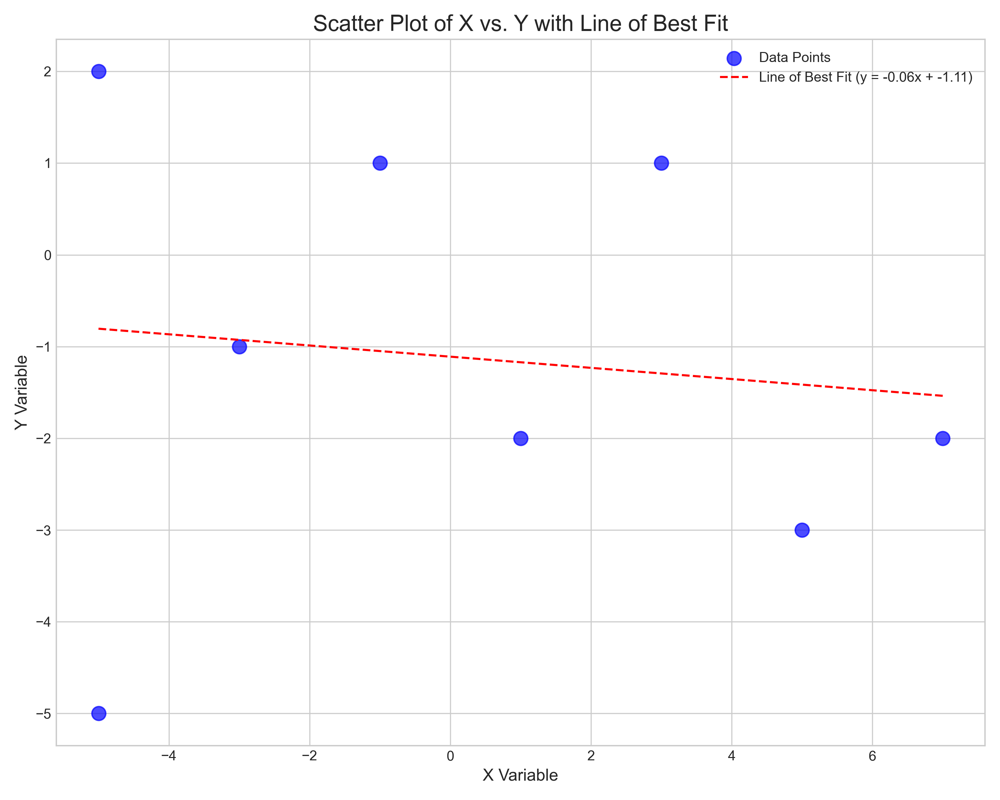

# AI and ML for Cybersecurity Midterm

Midterm exam project for AI and ML for Cybersecurity.

## Finding the Correlation (10 points)

### Assigment Description:

Find the data at the following address `max.ge/aiml_midterm/791204_html`.

Find Pearson's correlation coefficients and describe the process in your report. (5 points).

The report must also include a relevant graph for visualization. (5 points).

On the given online graph, the data is displayed with blue dots. When hovering the mouse over the data, the coordinates
of the data point are displayed on the screen.

### Solution:

The code at `finding-correlation/finding_correlation.py` extracts the data from the JavaScript code in the
HTML source, calculates the Pearson's correlation coefficient using NumPy, and creates a scatter plot with a line of
best fit using Matplotlib. The resulting visualization helps to confirm the weak negative correlation between the
variables.



---

## Finding the Correlation (10 points)

### Assigment Description:

Find the data at the following address `max.ge/aiml_midterm/791204_html`.

Find Pearson's correlation coefficients and describe the process in your report. (5 points).

The report must also include a relevant graph for visualization. (5 points).

On the given online graph, the data is displayed with blue dots. When hovering the mouse over the data, the coordinates
of the data point are displayed on the screen.

### Solution:

## Report

### 1. Data File

The data file "v_laluashvili_791204.csv" is located in the same directory as the Python script. The file contains email features with the following columns:
- words: Total number of words in the email
- links: Number of links in the email
- capital_words: Number of words in all caps
- spam_word_count: Count of words commonly associated with spam
- is_spam: Target variable (1 for spam, 0 for legitimate)

### 2. Logistic Regression Model

#### Source Code
The source code for the logistic regression model is included in the script file `spam-email-detection/spam-email-detection.py`.

#### Data Loading and Processing
The data was loaded from the local CSV file using pandas' `read_csv` function. After loading, I performed exploratory data analysis to understand the structure of the data, check for missing values, and examine the distribution of classes.

The data was split into features (X) and target (y), where the features are 'words', 'links', 'capital_words', and 'spam_word_count', and the target is 'is_spam'.

The data was further divided into training and testing sets using sklearn's `train_test_split` function, with 70% of the data used for training and 30% for testing. A random_state of 42 was set for reproducibility.

#### Model Used
I used a logistic regression model from sklearn's `LogisticRegression` class. Logistic regression is a suitable choice for binary classification tasks like spam detection. It models the probability that an email belongs to a particular class (spam or legitimate) based on its features.

#### Model Coefficients
The coefficients found by the model indicate the importance of each feature in determining whether an email is spam or legitimate. Positive coefficients increase the likelihood of an email being classified as spam, while negative coefficients increase the likelihood of it being classified as legitimate.

### 3. Model Testing

#### Confusion Matrix and Accuracy
The model was tested on the 30% of data not used for training. The confusion matrix and accuracy were calculated and visualized.

#### Code for Finding Confusion Matrix and Accuracy
The confusion matrix was created using sklearn's `confusion_matrix` function, which compares the actual labels (y_test) with the predicted labels (y_pred). The accuracy was calculated using sklearn's `accuracy_score` function, which measures the proportion of correctly classified emails.

The confusion matrix was visualized using seaborn's heatmap function to provide a clear visual representation of the model's performance.

### 4. Email Text Classification

The application includes functionality to check email text for spam. This involves:

1. Preprocessing the email text:
   - Converting to lowercase
   - Removing special characters, numbers, and punctuation
   - Tokenizing the text
   - Removing stopwords
   - Applying stemming using the Porter Stemmer algorithm

2. Extracting features from the preprocessed text:
   - Counting total words
   - Counting links (URLs)
   - Counting capital words
   - Counting spam words

3. Using the trained model to classify the email based on the extracted features.

### 5. Spam Email Example

I composed the following email text that was classified as spam by the model:

```
Congratulations! You've WON a $1,000,000 PRIZE! 
CLICK here to claim your REWARD now! 
This OFFER expires in 24 HOURS. 
Don't miss this OPPORTUNITY of a LIFETIME!
FREE MONEY for you!
```

This email was classified as spam because it contains typical spam characteristics such as:
- Exaggerated claims of winning a large prize
- Urgency tactics ("expires in 24 hours")
- Call to action to click a link
- Use of capital letters for emphasis
- Words commonly associated with spam ("congratulations", "won", "prize", "claim", "reward", "free", "money")

### 6. Legitimate Email Example

I composed the following email text that was classified as legitimate by the model:

```
Dear Team,

I hope this email finds you well. I'm writing to inform you about our upcoming meeting scheduled for next Tuesday at 2 PM. 
We will be discussing the Q3 financial results and planning for the next quarter. 
Please prepare your reports and be ready to present your department's achievements.

Best regards,
John Smith
```

This email was classified as legitimate because it exhibits characteristics of professional communication:
- Formal greeting and closing
- Clear and specific information about a meeting
- Professional language and tone
- No exaggerated claims or urgency tactics
- Proper formatting and structure

### 7. Data Visualizations

#### Visualization 1: Distribution of Email Classes
This visualization shows the distribution of spam and legitimate emails in the dataset. It helps us understand if the dataset is balanced or if there's a class imbalance, which could affect the model's performance.

#### Visualization 2: Feature Correlation Heatmap
This visualization shows the correlation between different features in the dataset. Features with high positive correlation (red) tend to increase together, while features with high negative correlation (blue) tend to have an inverse relationship.

#### Visualization 3: Box Plots for Each Feature by Class
This visualization shows the distribution of each feature (words, links, capital_words, spam_word_count) for both spam and legitimate emails. It helps identify which features are most discriminative between the two classes.

#### Visualization 4: Feature Importance
This visualization shows the importance of each feature based on the logistic regression coefficients. Features with higher positive coefficients contribute more to classifying an email as spam, while features with negative coefficients contribute to classifying an email as legitimate.

---

This solution provides a comprehensive approach to spam email detection using logistic regression. The application can be run as a console program and includes all the required functionality, including data loading, model training, testing, and email classification. The visualizations help in understanding the data distribution and feature relationships.